# Przewodnik: Wdrożenie aplikacji Docker na Render.com

Ten folder zawiera przykładową aplikację PHP (język nieobsługiwany natywnie przez Render, co wymaga użycia Dockera) oraz konfigurację niezbędną do jej uruchomienia na platformie [Render.com](https://render.com).

## 🚀 Instrukcja krok po kroku

### 1. Przygotowanie repozytorium
*   Upewnij się, że Twój kod znajduje się w repozytorium GitHub, GitLab lub Bitbucket.
*   Plik `Dockerfile` musi znajdować się w głównym katalogu projektu (lub musisz wskazać do niego ścieżkę w ustawieniach Render).

### 2. Tworzenie Web Serwisu na Render
1.  Zaloguj się do panelu [Render Dashboard](https://dashboard.render.com).
2.  Kliknij przycisk **New +** i wybierz **Web Service**.
3.  Wybierz swoje repozytorium z listy.
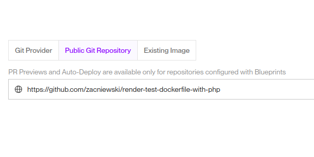  

4.  W polu **Runtime** wybierz **Docker**.
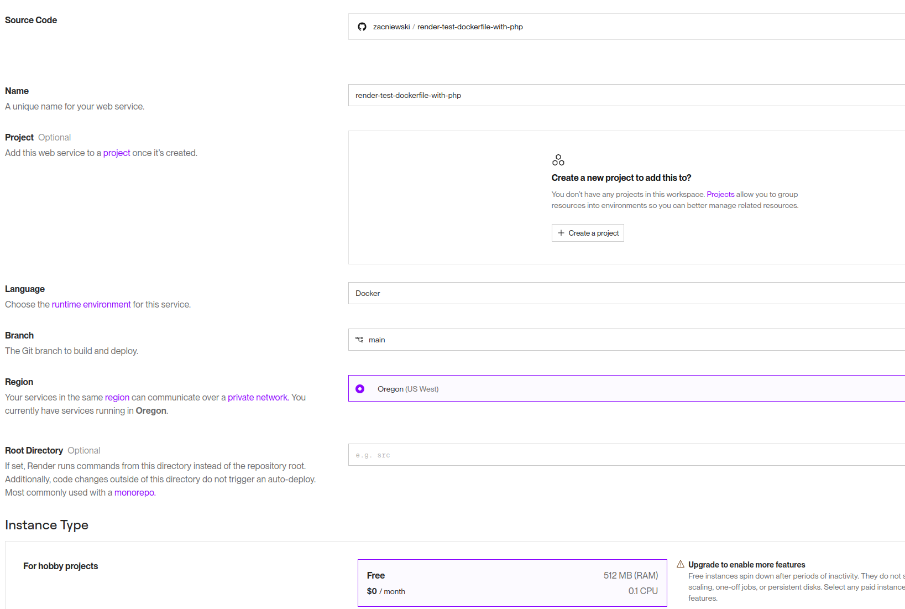

5.  W sekcji **Advanced** upewnij się, że **Dockerfile Path** jest ustawiony na `Dockerfile` (lub `.`) oraz **Build Context** na `.` (są to wartości domyślne, gdy pliki znajdują się w głównym katalogu).
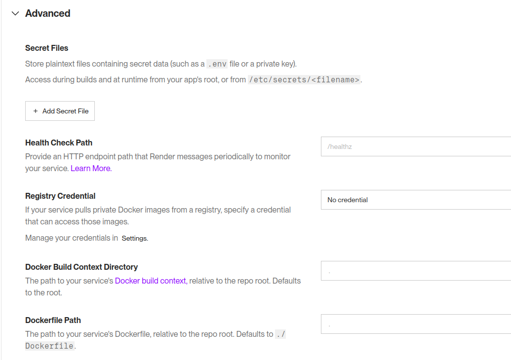

### 3. Konfiguracja zmiennych środowiskowych
Render wymaga, aby aplikacja nasłuchiwała na porcie zdefiniowanym w zmiennej środowiskowej `$PORT`.
*   W naszym `Dockerfile` rozwiązaliśmy to za pomocą komendy `sed`, która podmienia port w konfiguracji Apache:  
```dockerfile
# Etap 2: Konfiguracja Apache
# Render automatycznie przekierowuje ruch na port 80 (standard Apache)
# Jeśli Twoja aplikacja wymaga nasłuchiwania na porcie z zmiennej $PORT:
RUN sed -i 's/Listen 80/Listen ${PORT}/' /etc/apache2/ports.conf
RUN sed -i 's/:80/:${PORT}/' /etc/apache2/sites-available/000-default.conf
```
*   W przypadku innych technologii (np. Node.js), upewnij się, że startujesz serwer na `0.0.0.0:$PORT`.

---

## 🗄️ Obsługa Bazy Danych

Render oferuje dedykowane rozwiązanie **Managed PostgreSQL**, które jest najprostsze w konfiguracji.

### Opcja A: Render PostgreSQL (Zalecane)
1.  W panelu Render kliknij **New +** -> **PostgreSQL** (najlepiej otworzyć w nowej karcie przeglądarki, przed kliknięciem 'Deploy Web Service')
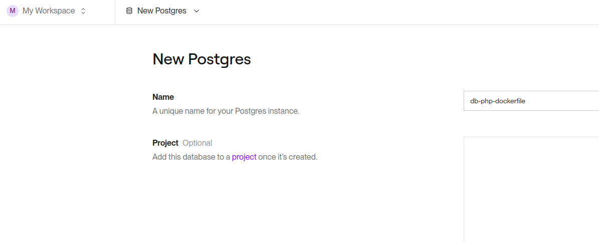
Klikamy na **Create database** i czekamy na utworzenie bazy danych.  

2.  Po utworzeniu bazy skopiuj **Internal Database URL**.
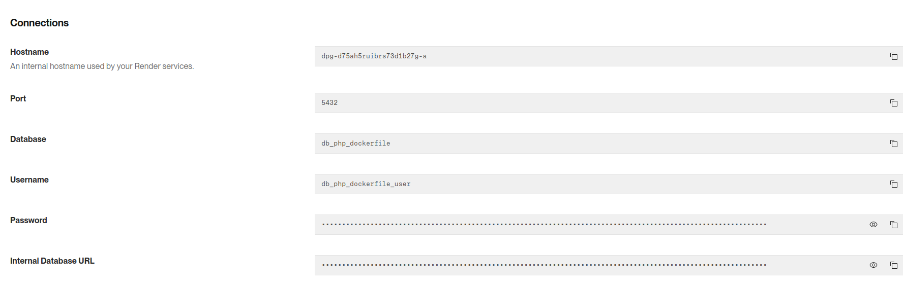

3.  W ustawieniach swojego Web Serwisu, w zakładce **Environment**, dodaj zmienną `DATABASE_URL` i wklej skopiowany link.
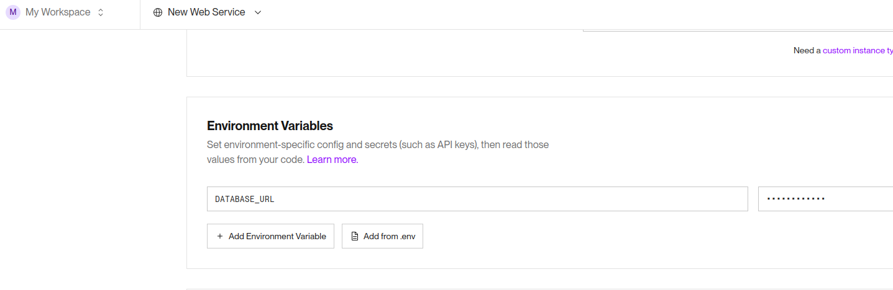

### Opcja B: Zewnętrzna baza (np. MongoDB Atlas, Supabase)
1.  Uzyskaj Connection String od dostawcy bazy.
2.  Dodaj go jako zmienną środowiskową w panelu Render (np. `DB_HOST`, `DB_PASSWORD`).

### Uruchamiamy **Deploy Web Service**
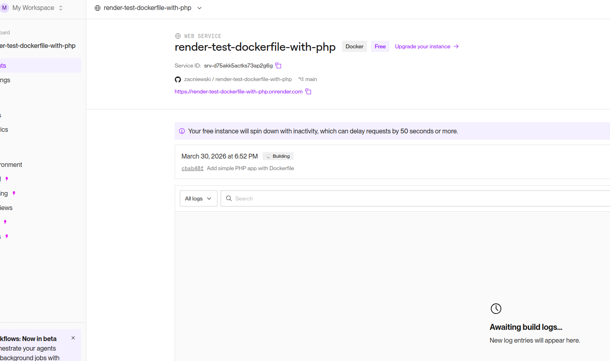

- czekamy na zbudowanie obrazu Dockerowego:  
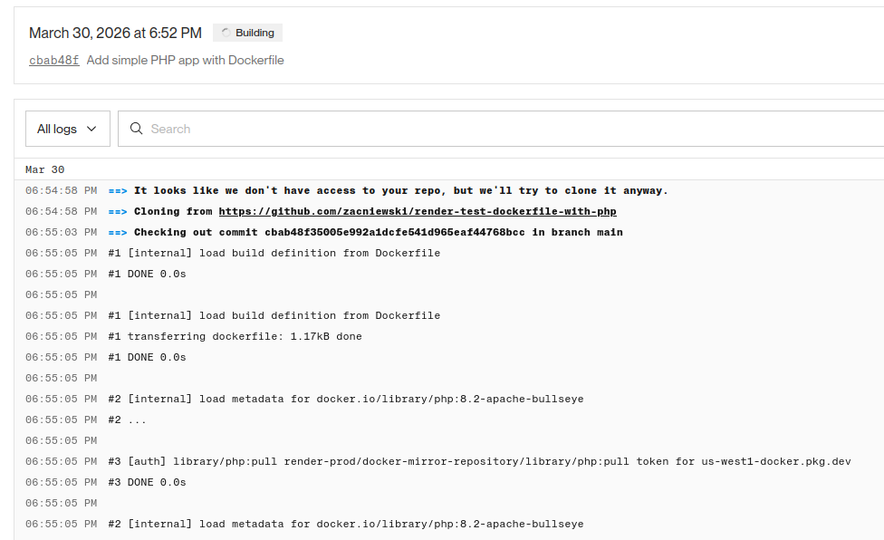  

- i po kilku minutach:  
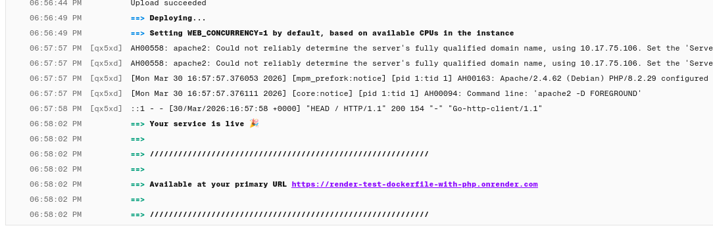  

- i nasz serwer jest gotowy: [link do aplikacji](https://render-test-dockerfile-with-php.onrender.com/)!

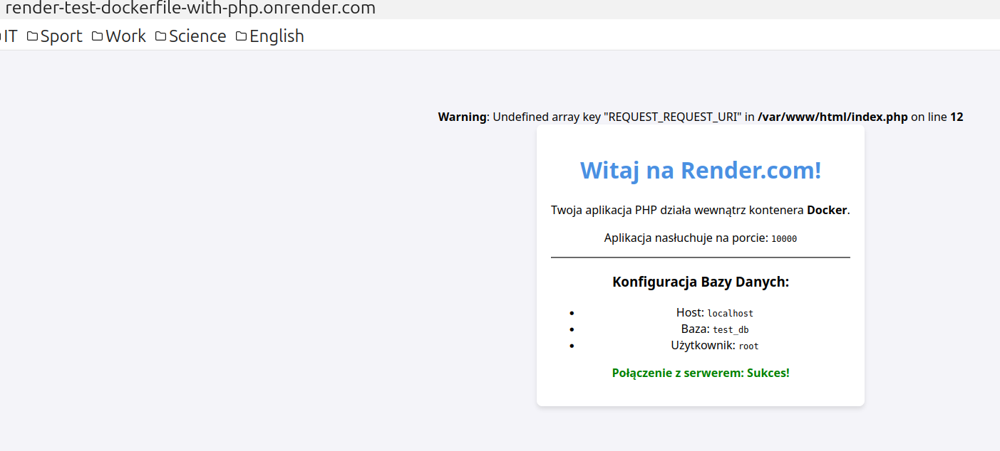

- pojawiło się ostrzeżenie związane z błędną nazwą zmiennej. Po poprawkach wybieramy opcję `Deploy latest commmit`:  
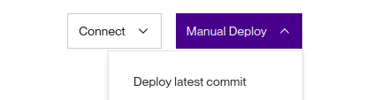  


- i tym razem wszystko działa jak należy:  
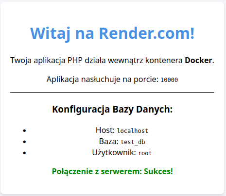  

---


## ✅ Checklista wdrożeniowa

- [ ] Plik `Dockerfile` jest poprawny i przetestowany lokalnie (`docker build .`).
- [ ] Aplikacja obsługuje zmienną środowiskową `PORT`.
- [ ] Dodano plik `.dockerignore`, aby nie wysyłać zbędnych plików (np. `node_modules`).
- [ ] Wszystkie wrażliwe dane (hasła, klucze API) są przekazywane przez **Environment Variables** w panelu Render, a nie zapisane w kodzie.
- [ ] (Dla PHP) Zainstalowano niezbędne rozszerzenia (np. `pdo_mysql`) w Dockerfile.

---

## 🛠️ Dlaczego Docker?
Render natywnie wspiera Node.js, Python, Ruby, Go, Rust i Elixir. Używając Dockera, możesz uruchomić:
*   **PHP** (Laravel, Symfony, WordPress).
*   **Java** (Spring Boot).
*   **C#** (.NET).
*   Dowolną inną technologię z własnymi zależnościami systemowymi.
